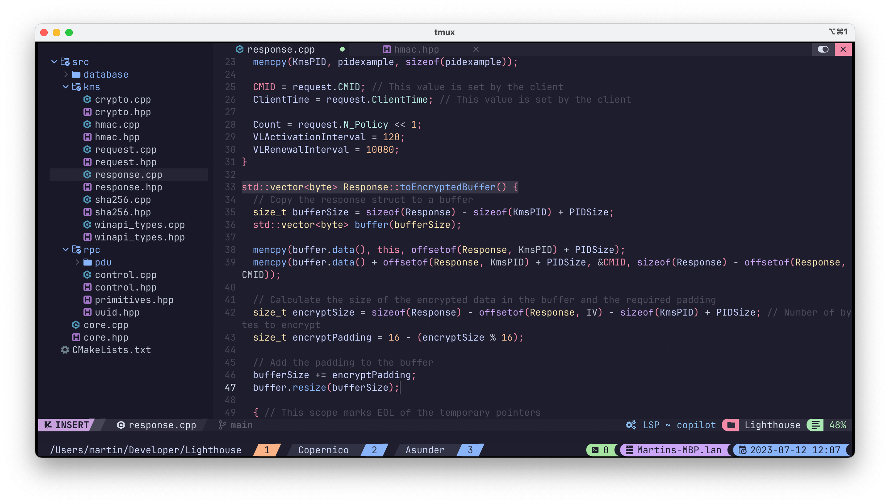

# Copernico 🤔
Copernico is my terminal configuration, based on NvChad and Tmux.
It is currently compatible with MacOS & Linux.
Windows compatibility can be achieved using WSL and the Terminal app.

### Main Features
* Previous configuration backup
* Catppuccin theme for Tmux and Neovim
* Syntax highlighting for many languages
* GitHub Copilot preinstalled
* Tmux Plugin Manager preinstalled
* Vim Tmux Navigator preinstalled
* Customized key bindings

### Prerequisites
* neovim
* tmux
* git
* iTerm2 on macOS
* Node.js (GitHub Copilot)
* Ripgrep (Telescope)

Note that some package managers might install an outdated version
of neovim. In that case, you can
[install neovim manually](https://github.com/neovim/neovim/releases).

### Set up Copernico
* Install the [JetBrainsMono Nerd Font](https://github.com/ryanoasis/nerd-fonts/releases/download/v3.0.2/JetBrainsMono.zip) and set it as the default terminal font
* Run copernico.py, `python3 copernico.py`
* Finalize installation by entering into neovim, `nvim`
* Run `:Copilot setup` inside neovim to activate GitHub Copilot

### How does it work?
Copernico utilizes a unique approach to minimize updates to our code on every commit
to NvChad. The Live-Patch model lets us maintain a collection of python scripts, instead
of maintaining forks of the relevant repositories. Each script changes specific and targeted
words and lines, contributing to our configuration in a different way. Those scripts are loaded on runtime from the `patches` directory and can be run individually.

### Updates
The `NvChadUpdate` command has been disabled in order to prevent overwriting patched files.
To update copernico, reinstall it using `copernico.py`.